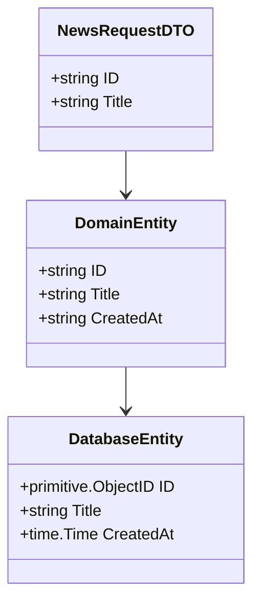

# Golang Hexagonal Architecture : CMS
ระบบการจัดการเนื้อหาของเว็บไซต์ (Content Management System : CMS) โดยมีส่วนของ Administration panel (เมนูผู้ควบคุมระบบ) ที่ใช้ในการบริหารจัดการส่วนการทำงานต่างๆในเว็บไซต์ ทำให้สามารถบริหารจัดการเนื้อหาได้อย่างรวดเร็ว และเน้นที่การ จัดการระบบผ่านเว็บ(Web interface) โดยใช้ Go , Fiber , MongoDB , Redis และ Hexagonal Architecture 

# 📚 Table Of Contents
- [Hexagonal Architecture](#hexagonal-architecture)
- [Why Hexagonal Architecture](#why-hexagonal-architecture)
- [Setup Instructions](#setup-instructions)
- [Project Structure](#project-structure)
- [Data Transfer Object](#data-transfer-object)

## Hexagonal Architecture
Hexagonal Architecture หรือที่รู้จักในชื่อ Ports and Adapters Architecture เป็นรูปแบบของสถาปัตยกรรมซอฟต์แวร์ที่มีจุดเด่นคือการแยก Business Logic (Core) ออกจาก องค์ประกอบภายนอก เช่น Web Framework, Database, หรือบริการภายนอกอื่น ๆ เพื่อให้ระบบมีความยืดหยุ่นและทดสอบได้ง่าย

ในสถาปัตยกรรมนี้ ทุกองค์ประกอบจะสื่อสารกันผ่าน Ports , Adapters ซึ่งจะแบ่งเป็น Primary , Secondary โดยมีหัวใจสำคัญของระบบคือ Business Logic Core :

#### 🔌 Ports 
**Ports** คือ "จุดเชื่อมต่อ" (interfaces) ที่กำหนดสิ่งที่ Core ต้องการจากโลกภายนอก เช่น การบันทึกข้อมูล หรือส่งอีเมล ซึ่งไม่ระบุว่าใช้ระบบใด ขอแค่ทำตาม "ข้อตกลง" ที่กำหนดไว้ โดยจะแบ่งเป็น
-  **Primary Port or Driven Port** คือ interfaces ที่ โลกภายนอกเรียกเข้ามา ใช้งาน Business Logic เช่น HTTP (Fiber)
-  **Secondary Port or Driven Port** คือ interfaces ที่ Business Logic เรียกออกไป เพื่อใช้งานสิ่งภายนอก เช่น Database(Mongodb) , Cache (Redis)

#### 🌉 Adapters 
**Adapters** คือ "ตัวแปลง/สะพาน" ที่ทำหน้าที่เชื่อมระหว่าง Ports กับระบบภายนอกจริง เช่น ฐานข้อมูล MongoDB, Redis, HTTP API ฯลฯ โดยจะแบ่งเป็น 
- **Primary Adapters or Driving Adapters** คือ adapter สำหรับการ handle (และทำการแปลง) input ที่เข้ามาใน application เพื่อเตรียมสำหรับใช้งานใน application core logic
- **Secondary Adapters or  Driven Adapters** คือ  adapter สำหรับการพูดคุยกับภายนอก เช่น database adapter สำหรับการแปลงข้อมูลเป็น query เพื่อใช้สำหรับเรียกไปยัง database ปลายทาง

#### 🫀 Business Logic Core
**Business Logic** หรือ **แกนหลักของระบบ** คือส่วนที่กำหนดขั้นตอนการทำงาน, การประมวลผล และกฎของแอปพลิเคชัน เช่น:

- ตรวจสอบว่าบัญชีผู้ใช้นั้นซ้ำหรือไม่  
- คำนวณราคาสุทธิของสินค้า  
- ตรวจสอบความสมบูรณ์ของข้อมูลก่อนดำเนินการ

---
#### ⚠️ หลักการสำคัญ:
> **Business Logic Core จะทำงานผ่าน Ports เท่านั้น**  
> ไม่รู้จัก และ **ไม่ควรยุ่งเกี่ยวโดยตรง** กับองค์ประกอบภายนอก เช่น Web Framework, Database, หรือ Third-Party Services ใด ๆ
---

📌 จุดเด่นคือ **ความเป็นกลางต่อเทคโนโลยี** ทำให้สามารถทดสอบ ต่อยอด และเปลี่ยนเทคโนโลยีภายนอกได้โดยไม่กระทบ Logic หลัก


## Why Hexagonal Architecture

การประเมินระบบของ **ระบบการจัดการเนื้อหาของเว็บไซต์ (Content Management System: CMS)** ในระยะยาวเกี่ยวกับการดูแล หรือการบำรุงรักษา (Maintenance) นั้น การใช้ **Hexagonal Architecture** สามารถทำได้ง่ายและสะดวกมากขึ้น เพราะ:

### 1. การเปลี่ยนแปลง Database หรือเพิ่ม Database ได้ง่าย
- หากในอนาคตต้องการเปลี่ยนแปลงฐานข้อมูล หรือการเพิ่มฐานข้อมูลใหม่เข้ามาในระบบ สามารถทำการเปลี่ยนแปลงใน **Database Layer** ได้โดยไม่กระทบกับส่วนอื่นๆ ของระบบ เนื่องจาก **Hexagonal Architecture** ทำการแยกความรับผิดชอบระหว่าง **Business Logic Core** และ **External Components** (เช่น Database, API, หรืออื่น ๆ)
- ตัวอย่างเช่น หากตอนนี้ใช้ MongoDB แล้วในอนาคตต้องการย้ายไปใช้ PostgreSQL ก็สามารถทำได้ง่าย ๆ แค่เปลี่ยนใน Adapter Layer ที่เชื่อมต่อกับ Database ใหม่ โดยไม่ต้องไปแก้ไขที่ **Business Logic Core** เลย

### 2. การตรวจสอบข้อผิดพลาดได้ง่าย
- การแยกส่วนความรับผิดชอบอย่างชัดเจนระหว่าง **Business Logic** (หรือ Core) และ **External Components** ทำให้สามารถตรวจสอบข้อผิดพลาดได้ง่ายขึ้น เนื่องจากจะมีแค่จุดเชื่อมต่อ (ports) ที่ถูกกำหนดไว้ชัดเจน
- เมื่อเกิดข้อผิดพลาด เราสามารถโฟกัสไปที่ส่วนที่เกี่ยวข้อง เช่น ถ้าเกิดปัญหาจากฐานข้อมูลหรือระบบภายนอก ก็สามารถตรวจสอบได้ที่ Adapter ที่เชื่อมต่อกับระบบเหล่านั้น

### 3. รองรับการเปลี่ยนแปลงได้ดีในอนาคต
- **Hexagonal Architecture** ออกแบบให้ระบบสามารถขยายตัวได้โดยไม่กระทบกับส่วนหลักของระบบ สามารถปรับเปลี่ยนหรือลองทดสอบเทคโนโลยีใหม่ ๆ โดยไม่ส่งผลกระทบต่อ **Business Logic Core**
- การเพิ่มฟังก์ชันใหม่ หรือการเปลี่ยน Web Framework หรือ API ที่ใช้งาน สามารถทำได้โดยไม่กระทบกับ **Business Logic** ที่สำคัญ

### 4. การทดสอบระบบง่ายขึ้น
- ด้วยการแยกส่วนต่างๆ ของระบบออกจากกัน ทำให้สามารถทำ **Unit Testing** ได้สะดวกมากขึ้น โดยสามารถทดสอบ **Business Logic** โดยไม่ต้องพึ่งพาส่วนประกอบภายนอก

### 5. ปรับใช้เทคโนโลยีใหม่ ๆ ได้ง่าย
- เมื่อระบบออกแบบตาม **Hexagonal Architecture** จะทำให้การเปลี่ยนแปลงหรือการทดลองใช้เทคโนโลยีใหม่ ๆ (เช่น การเปลี่ยนไปใช้ GraphQL , gRPC แทน REST API) สามารถทำได้โดยไม่กระทบกับ **Business Logic Core**
- สามารถพัฒนา **Adapter** ใหม่เพื่อรองรับการเปลี่ยนแปลงเทคโนโลยีภายนอกเหล่านั้น โดยไม่ต้องแก้ไขการทำงานภายในของระบบ
---

**สรุป:** การใช้ **Hexagonal Architecture** ในการพัฒนาระบบ CMS ช่วยให้ระบบมีความยืดหยุ่นในการปรับเปลี่ยน เพิ่มเติม และสามารถดูแลรักษาได้ง่ายในระยะยาว พร้อมทั้งทำให้การทดสอบ, การตรวจหาข้อผิดพลาด, และการเพิ่มฟังก์ชันใหม่ ๆ 

## Data Transfer Object
DTO (Data Transfer Object) เพื่อให้ระบบมีความยืดหยุ่นและแยก concerns ออกจากกันอย่างชัดเจน ได้ใช้ DTO (Data Transfer Object) ในการรับข้อมูลจาก HTTP Request และส่งข้อมูลออกจาก Service Layer หรือ Business Logic Layer ไปฝั่ง client หรือส่งต่อไปยัง Layer อื่น ๆ และมีการในทางกลับกันก็มีการใช้ Mapping ใน database layers เพื่อแปลงข้อมูลจาก mongodb ให้เข้ากับ domain แล้วแปลงจาก domain ไปยัง response entities

#### ตัวอย่าง ( กรณีรับ HTTP To Database)


## Setup Instructions
```bash
git clone https://github.com/Teaboyds/Tech_Movement.git

cd Tech_Movement

go mod tidy  

docker run --name redis -p 6379:6379 -d redis

cd cmd

go run .                                   
```

### คำอธิบาย:
1. **Clone the repository**: ดาวน์โหลดโปรเจกต์จาก GitHub มาไว้ในเครื่อง
2. **Navigate to the project directory**: เข้าไปยังโฟลเดอร์โปรเจกต์ที่เพิ่ง clone มา
3. **Install dependencies**: ใช้คำสั่ง `go mod tidy` เพื่อติดตั้ง dependencies ที่จำเป็นสำหรับโปรเจกต์
4. **Run Redis (optional)**: ถ้าระบบใช้ Redis ก็สามารถดึง Docker container สำหรับ Redis มาใช้ได้
5. **Start the application**: เปลี่ยนไปที่โฟลเดอร์ `cmd` และรันแอปพลิเคชัน Go


## Project Structure
```bash 
go-hexagonal-CMS/
├── cmd/
│ └── main.go                                           # Application entrypoint
│
├── internal/
│ ├── adapter/                                          # Infrastructure layer (adapters)
│ │    ├── config/                                      # Configuration loaders
│ │    ├── handler/                                     # HTTP handlers (controllers)
│ │    ├── logger/                                      # Logging (zap)
│ │    └── storage/                                     # Storage adapters
│ │        ├── mongodb/                                 # MongoDB implementation 
│ │        │    ├── db.go
│ │        │    ├── models/                             # Mongo document structs entity
│ │        │    ├── repository/                         # Mongo repository implementations
│ │        │    └── utils/                              # Mapping, ID conversion, etc.
│ │        └── redis/ # Redis client
│ └── core/                                             # Domain layer (hexagonal core)
│      ├── domain/                                      # Entities and business models
│      ├── port/                                        # Interfaces (input/output ports)
│      ├── service/                                     # Use cases (application services)
│      └── utils/                                       # Domain-level helpers
│
├── docs/                                               # Swagger & documentation
│
└── docker-compose.yml # Service orchestration (Mongo, Redis, etc.)
```

# Credit
- [Fiber](https://github.com/gofiber/fiber)
- [MongoDB Go Driver](https://github.com/mongodb/mongo-go-driver)
- [Redis](https://github.com/go-redis/redis)
- [mikelopster/Code_Architecture](https://docs.mikelopster.dev/c/goapi-essential/chapter-7/intro/)
- [LordMoMA/Hexagonal-Architecture](https://github.com/LordMoMA/Hexagonal-Architecture.git)
- [Ultimate_Guide_to_Mastering_Hexagonal](https://scalastic.io/en/hexagonal-architecture-domain/)
